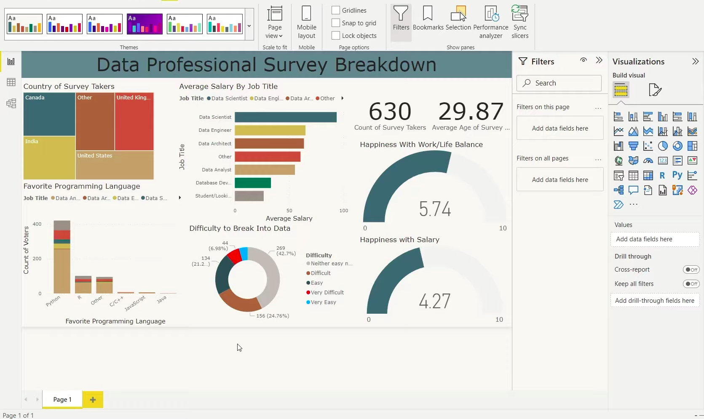

# Data Professional Survey Breakdown Dashboard
<h1 align="center">
  
</h1>
## Description
This project visualizes insights from a survey of data professionals, such as data scientists, analysts, and engineers. It provides a breakdown of demographics, average salaries, job satisfaction, and challenges professionals face in the field. The dashboard aims to offer a quick and comprehensive overview of the state of the data industry, including:

- **Demographics** (Country distribution of survey takers)
- **Favorite Programming Languages** among data professionals
- **Average Salary by Job Title** 
- **Happiness with Work/Life Balance and Salary**
- **Difficulty to Break into the Data Industry**

The visualizations help viewers understand the correlations between roles, salary, satisfaction, and job entry difficulty.

## Dashboard Components
1. **Country of Survey Takers**:  
   - A treemap visual shows the distribution of respondents by country.

2. **Average Salary by Job Title**:  
   - A bar chart compares the average salaries of different job roles such as Data Scientist, Data Engineer, and others.

3. **Favorite Programming Language**:  
   - A stacked column chart shows how the preferred programming language varies among different job titles.

4. **Difficulty to Break into Data**:  
   - A donut chart provides the percentage breakdown of the difficulty experienced in entering the data field.

5. **Happiness with Work/Life Balance & Salary**:  
   - Two gauge charts display the average satisfaction scores for work/life balance and salary on a scale from 0 to 10.

6. **Summary Statistics**:  
   - Cards showing the **total number of survey respondents** and the **average age** of survey participants.

## Steps to Recreate this Dashboard

1. **Data Preparation**:
   - Collect survey data containing fields such as country, job title, salary, programming language, and satisfaction ratings.
   - Clean the dataset using Excel or Power Query in Power BI (e.g., remove missing values, standardize field names).

2. **Importing Data**:
   - Load the cleaned data into Power BI using the "Get Data" feature.
   - Transform and model the data to ensure relationships between tables, if needed.

3. **Building Visuals**:
   - **Treemap**: Visualize the survey respondents by country.
   - **Bar Chart**: Display the average salaries for each job title.
   - **Stacked Column Chart**: Show the distribution of programming language preferences among different roles.
   - **Donut Chart**: Represent the difficulty levels of entering the data field.
   - **Gauge Charts**: Track average ratings for work/life balance and salary satisfaction.
   - **Cards**: Use cards to highlight key metrics like the total number of survey respondents and average participant age.

4. **Formatting & Styling**:
   - Apply themes and consistent colors to ensure the dashboard is visually appealing.
   - Add titles and tooltips for better interpretability.
   - Use the **Performance Analyzer** to ensure optimal loading time.

5. **Filters and Interactivity**:
   - Add slicers (filters) to allow users to explore the data by country, job title, or programming language.
   - Enable cross-report drill-throughs for deeper analysis.

6. **Publishing**:
   - Test the dashboard for usability and responsiveness.
   - Publish the report to the Power BI service or export it as a PDF or PowerPoint for sharing.

## Technologies Used
- **Power BI**: Data visualization and dashboard creation
- **Excel/CSV**: Data preprocessing and cleanup (optional)
- **DAX (Data Analysis Expressions)**: Used for custom metrics and calculations

## How to Use This Repository
1. Clone this repository to your local machine.
2. Download the dataset (or use the provided example data, if included).
3. Follow the steps in the README to build the dashboard in Power BI.
4. Optionally, modify the visuals or data to create your own version.

## Skills Demonstrated
This project demonstrates my ability to:
- Work with data visualization tools like Power BI.
- Analyze survey data to extract meaningful insights.
- Create interactive dashboards for exploratory analysis.
